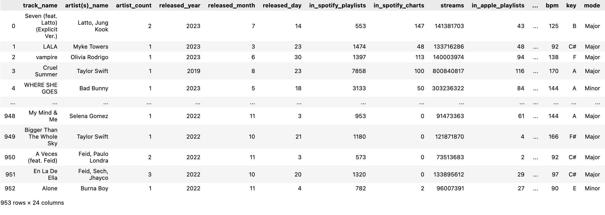
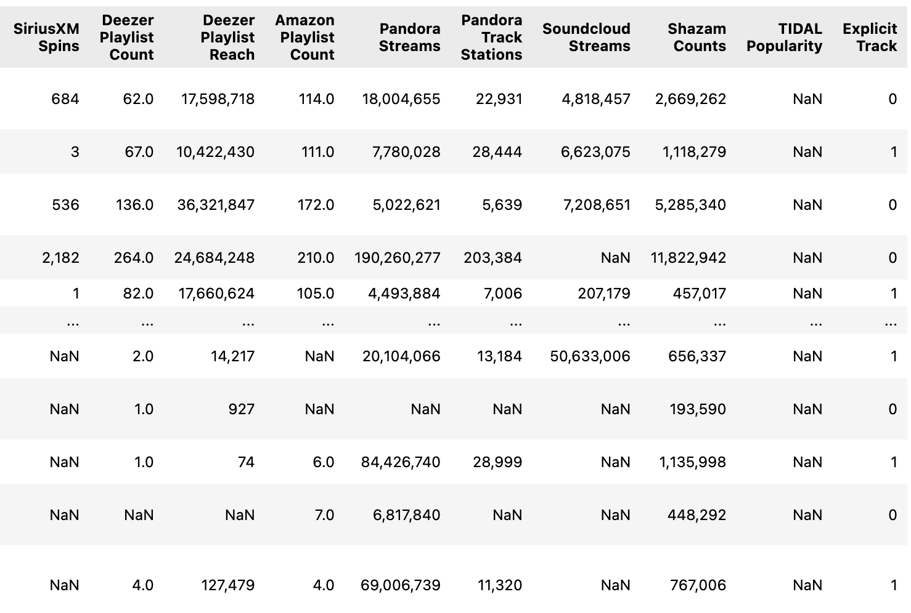
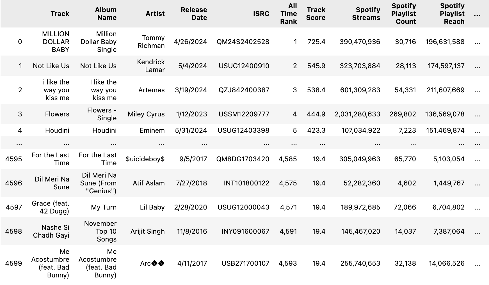

## Overall Description

- This project aims to analyze and compare music trends and user preferences for various genres in 2023 and 2024. By leveraging track-level features and popularity metrics, the analysis will provide insights into how music styles evolve over time, as well as highlight top tracks and artists for each year. The findings will be particularly useful for musicians, singers, and entertainment companies to understand and adapt to shifting audience preferences.

## Objectives 

* Examine trends in music styles using track features (e.g., tempo, danceability, energy, etc.).
* Provide actionable insights for musicians, singers, and entertainment companies about the trending music styles.
* Identify top tracks and artists of 2023 and compare them with those in 2024.
* Highlight any significant changes in user preferences or genre popularity between the two years.

## Data Summary

### Data Source

* https://www.kaggle.com/datasets/nelgiriyewithana/top-spotify-songs-2023

* https://www.kaggle.com/datasets/nelgiriyewithana/most-streamed-spotify-songs-2024

### Data Description

* These datases present a list of most famous songs of 2023 and 2024 as listed on Spotify. They provide insights into each song's features, popularity and their presence on audio streaming platforms like Apple Music, Soundcloud,... or other platforms like YouTube or TikTok. 

#### Dataset Structure

* 2023 dataset: 953 rows and 24 columns, which include track names, artists, presence in audio streaming platforms, and features of songs (danceability%, valence%, ...). The following shows a sample of the data:

    

    

* 2024 dataset: 4600 rows and 29 columns. This dataset has more records and more information regarding songs' presence in different platforms, but doesn't have the data regarding songs' features (danceability%, valence%, ...). The following shows a sample of the data:

    

    

## Exploratory Data Analysis

#### Correlation between songs' features

    

